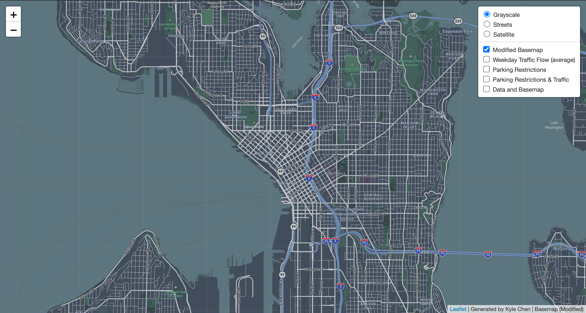
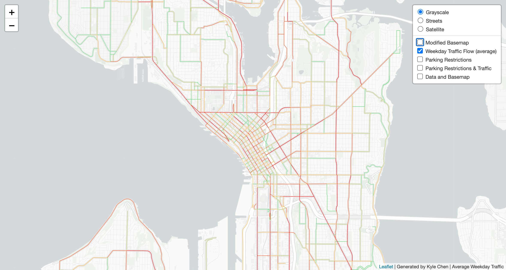
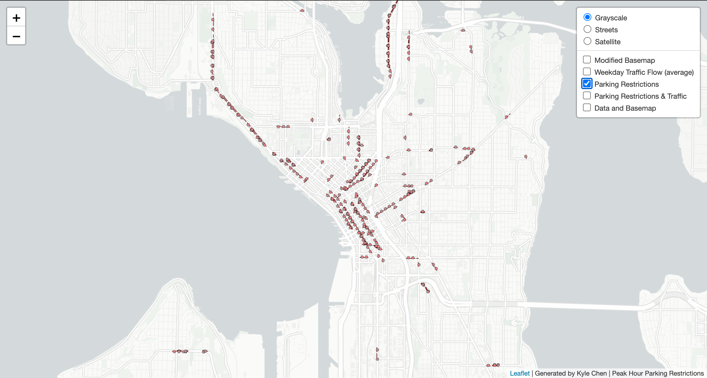
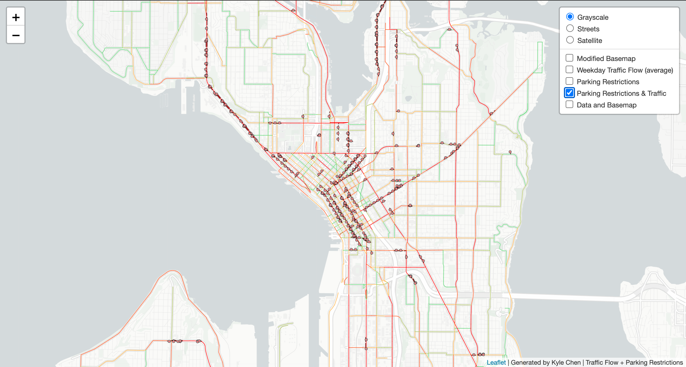
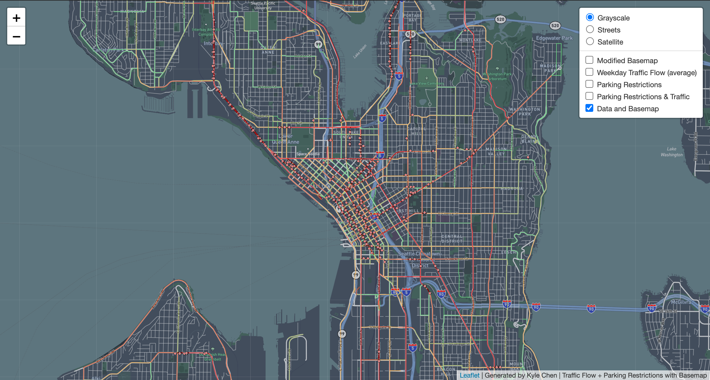

# Traffic Flow and Parking Restriction in the City of Seattle

Link to hosted webmap: https://kyle0828.github.io/Seattle_traffic_parking/
- Author: Kyle Chen
- Date: 2021/03/12

## Intro
The project is intended to benefit people who travel to or work in the City of Seattle to avoid the major streets that are expected to have heavy traffic during weekdays. In addition, the parking spaces where people are not allowed to park or stop their vehicle during a specific time period in the city are also indicated on the web map. These datasets combine to emphasize the streets to avoid driving during peak hours on weekdays.

## Features of the web map
### Basemap:
There are three basic options of base map that users can choose to use, grayscale, streets, and satellite. Moreover, I use [Mapbox](https://www.mapbox.com/) to produce a modified base map, which its original purpose is designed to serve as a navigation map, it offers users an extra option to choose from. However, I did some slight adjustments to the color of the road network. I changed the color of road labels to black as well as the color of roads to light gray, as these adjustments of colors make the features more obvious and fit better to the way that I display my datasets on the web map.

### Data:
#### Average Weekday Traffic flow:
This dataset was found on the website, [Seattle GeoData](https://data-seattlecitygis.opendata.arcgis.com/).
It is published in *August 31st, 2019*.

More information: [View](https://drive.google.com/file/d/1H-ooaihoawm8zXjZz_-AhBmwyRiT1FWQ/view "2018 Traffic Flow Counts")

It contains many different types of traffic data. The column that I used is called AWDT_ROUND which stands for Average Weekday Traffic count and the numeric data is rounded to the nearest hundred. The reason why I decided to use it is because that people normally visit downtown Seattle from Monday thru Friday, excluding holidays and weekends. This AWDT_ROUND data is exactly providing what I am intended to show. There are also some other interesting data in this dataset, such as peak traffic count in both the AM and PM hours.

#### Peak Hour Parking Restrictions:
This dataset was found on the website, [Seattle GeoData](https://data-seattlecitygis.opendata.arcgis.com/).
The dataset I used is published in *March 10, 2021*, and it is still updating every week.

More information: [View](https://drive.google.com/file/d/1H-ooaihoawm8zXjZz_-AhBmwyRiT1FWQ/view "Peak Hour Parking Restrictions")

It indicates the roadways in the City of Seattle which the parking spaces are currently restricted in a specific time period during a day. The current popular navigation apps like Google Maps are still not able to provide people information about restricted parking spaces, especially in downtown Seattle where vehicles are not permitted to stop or park at certain major streets during peak hours. This may sometimes confuse people and it might end up causing their vehicle to be towed away. Therefore, this is the reason why I chose to use this dataset so that I can identify where the parking spaces with restrictions are located to help mitigate the chances of vehicles being towed.

## Software and tools I used:
- [QGIS](https://www.qgis.org/en/site/)
- [Mapbox](https://www.mapbox.com/)

I used two QGIS plugins, including **QMetaTiles** and **QuickMapServices**, to create a map layer and load online map service. The modified base map in the web map is obtained from Mapbox Studio, and it is loaded to QGIS via QuickMapServices. Furthermore, the file format of the two datasets that I used are both shapefile, which they already contain vector features. I imported them as vector layers and changed the symbology on both of the datasets. The symbology that I decided for peak hour parking restrictions dataset, is a line object with red x markers on it to express the ideology of “do not park here”. The dataset of traffic flow counts is a lot more complicated to handle than the other one. I chose to use graduated color symbology to show the quantitative difference between light traffic and heavy traffic. The number of the average weekday traffic flow is ranged from 400 to 98700, thus, I divided them into 5 classes using the method called Equal Count (Quantile). The color that I chose for *light traffic* is **light green**, **orange** for *moderate traffic*, and lastly, **dark red** for *heavy traffic*. The reason behind the decision of colors is because I believe people are used to this color scheme due to the popularity of Google Maps, which is exactly how Google indicates the traffic volume on its map.

## Story behind the map:
We all know that Google Maps and other navigation apps like Waze and Apple Maps are widely being used in people’s daily life, paper maps are already out of date. Therefore, generating such a web map like this is becoming vital to people’s lives as it shows critical information. One of the datasets is showing the traffic volume on major streets and roads, and the other dataset is indicating the locations of parking spaces with restrictions during specific time periods in a day. These two data combine to convey the reason why the government of the city of Seattle has made this type of decision to restrict parking spaces, especially within the downtown area. By looking at the layer called *Parking Restrictions & Traffic*, which is showing the result of combining the two vector layers together. Most of the major streets in the City of Seattle are colored in dark red and red, I believe this is due to the fact that Seattle apparently needs improvement on its public transportation system to transport individuals from neighbor residential areas to downtown for work.
The streets that have both a high volume of traffic and implementation of parking restriction are
- NE 65th Street
- 25th Ave NE
- Eastlake Ave E
- Aurora Ave N
- 15th Ave W
- Elliott Ave W
- 1st Ave
- 2nd Ave
- 4th Ave
- Madison St
- and more...

These roads and streets are mostly main roads connecting downtown Seattle to North Seattle where more residential areas are located. Others are roads that lead to a highway entrance, and the rest are streets in the downtown area. The city government definitely want to mitigate car accident that happens during peak hours, so that’s why they don’t want people to park or stop their vehicle at these busy roads to avoid causing more chaos.

## Description of the Tiles
### Tile 1 Screenshot - Modified Basemap

- Description of Tile: Modified basemap showing downtown Seattle area. The color of roads have been changed.
- Geographic Area of Focus: Seattle, WA
- Zoom Levels: Max Zoom - 14; Min Zoom - 10

### Tile 2 Screenshot - Map Data (Traffic Flow in Weekdays)

- Description of Tile: Data layer showing downtown Seattle area with the average traffic flow during weekdays.
- Geographic Area of Focus: Seattle, WA
- Zoom Levels: Max Zoom - 14; Min Zoom - 10

### Tile 3 Screenshot - Map Data (Restricted Parking Area)

- Description of Tile: Data layer showing the streets that have parking restriction in downtown Seattle.
- Geographic Area of Focus: Seattle, WA
- Zoom Levels: Max Zoom - 14; Min Zoom - 10

### Tile 4 Screenshot - Map Data (Traffic Flow in Weekdays & Restricted Parking Area)

- Description of Tile: Tile utilizing the map data from Tile 2 and Tile 3.
- Geographic Area of Focus: Seattle, WA
- Zoom Levels: Max Zoom - 14; Min Zoom - 10

### Tile 5 Screenshot - Basemap and Data

- Description of Tile: Tile utilizing the modified basemap from Tile 1 and the map data from Tile 4.
- Geographic Area of Focus: Seattle, WA
- Zoom Levels: Max Zoom - 14; Min Zoom - 10

#### Data Sources:
- Seattle GeoData:
[Link](https://data-seattlecitygis.opendata.arcgis.com/)

- 2018 traffic flow counts (8/31/2019):
[Link](https://data-seattlecitygis.opendata.arcgis.com/datasets/2018-traffic-flow-counts?geometry=-122.572%2C47.568%2C-122.077%2C47.649&orderBy=AWDT_ROUNDED&orderByAsc=false)

- Peak Hour Parking Restrictions (3/10/2021):
[Link](https://data-seattlecitygis.opendata.arcgis.com/datasets/peak-hour-parking-restrictions?geometry=-122.594%2C47.571%2C-122.100%2C47.652)
